# Mini3DCad
## 三面図からつくる三次元ＣＡＤ

平面図や側面図で作成した図形から3D図形を作成する三次元CAD  
当初、サーフェースのグラフィックライブラリを自作して作っていたが描画速度や機能的に限界があったので OpenGL を使って作成。  
使い方などは[説明書](Document/Mini3DCad_Manual.pdf)を参照。  
実行方法は[Mini3DCad.zip](Mini3DCad.zip)をダウンロードし適当なフォルダーに展開して CadApp.exe を実行する。
### 画面
2D表示    
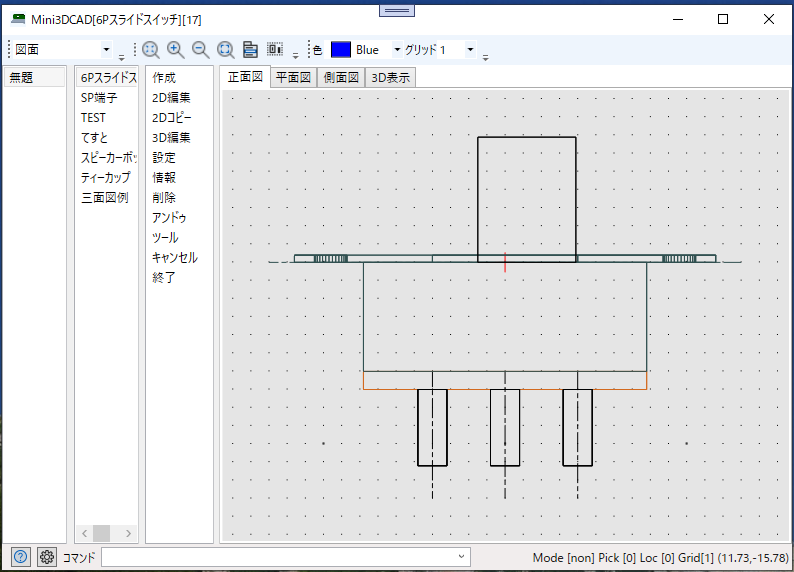  

3D表示  
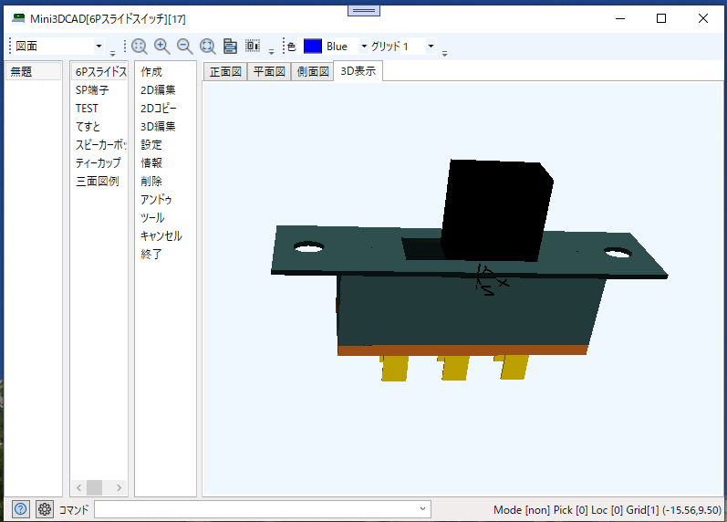  

2Dデータから3Dデータの作成(押出)  
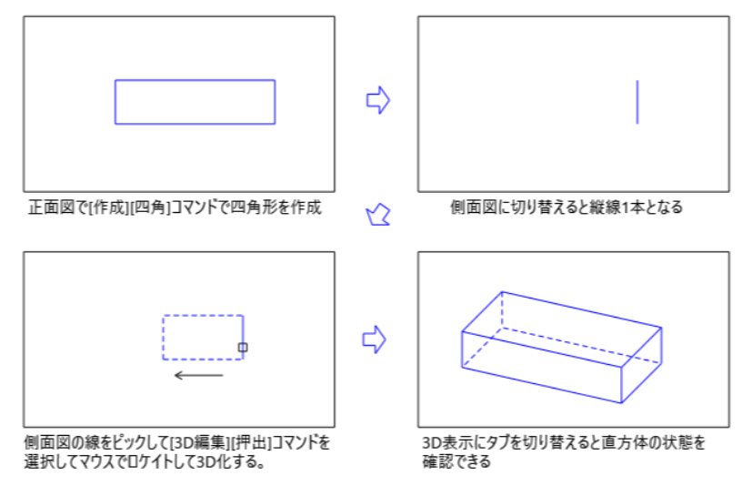  

スピーカ端子(2D)　　
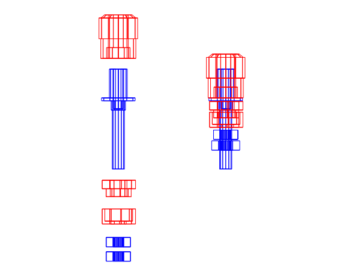  
スピーカ端子(3D)　　
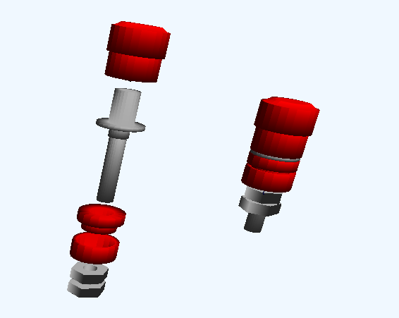  

ティーカップ(2D)　　
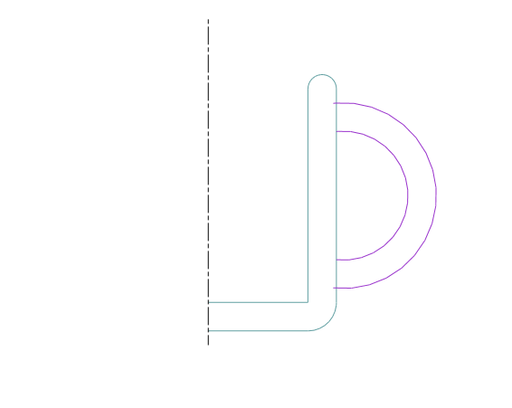  

ティーカップ(3D化)　　
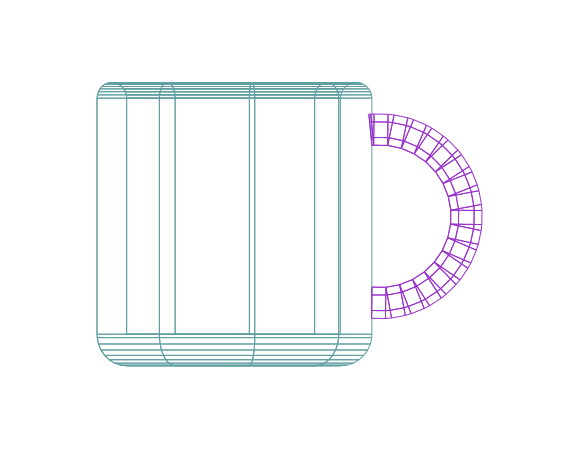  

ティーカップ(3D)　　
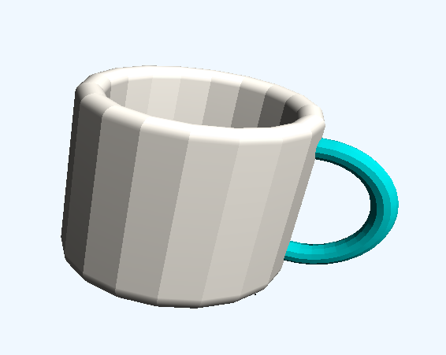  

スピーカ(正面図、側面図)  
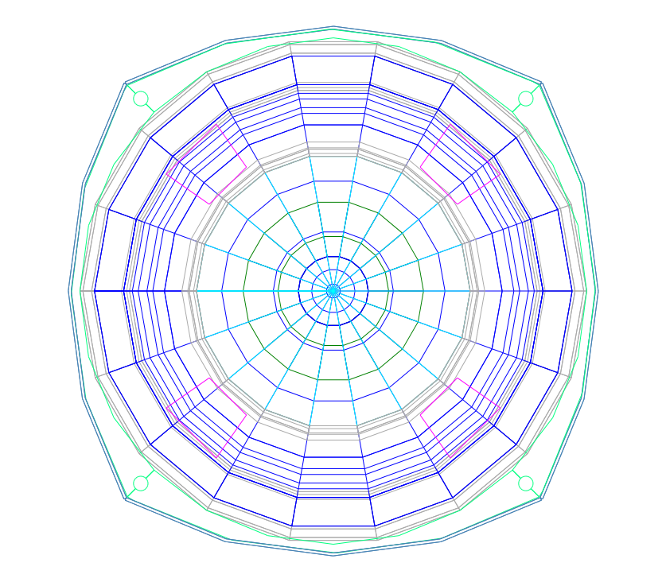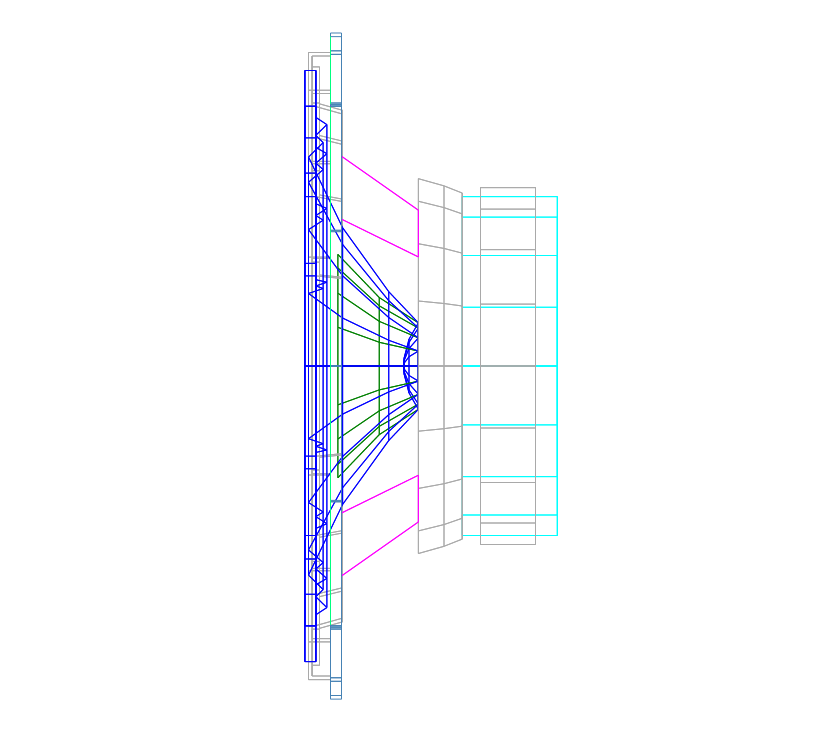  

スピーカ(3D)
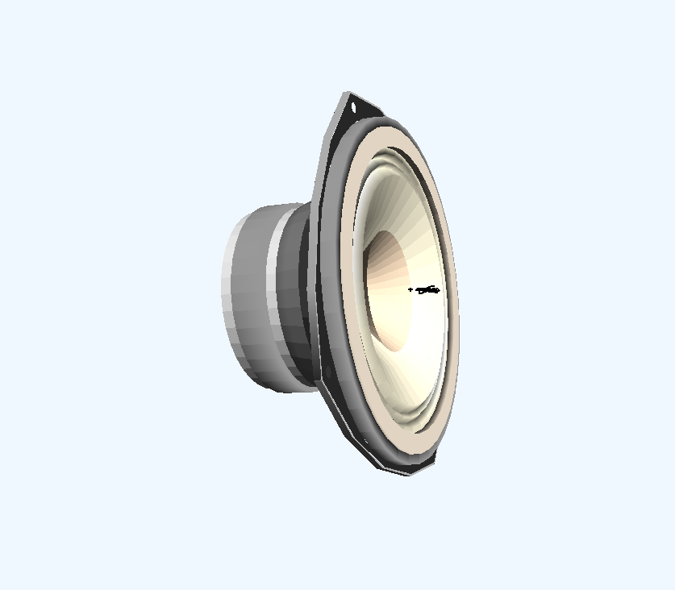  

バックロードホーン(2D)  
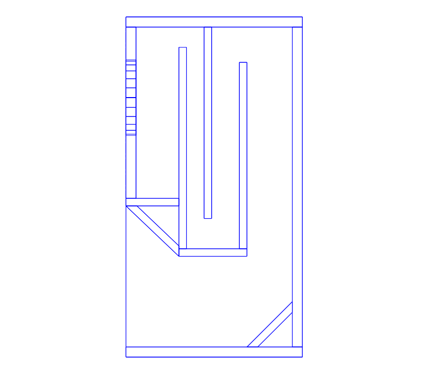  
バックロードホーン(3D)  
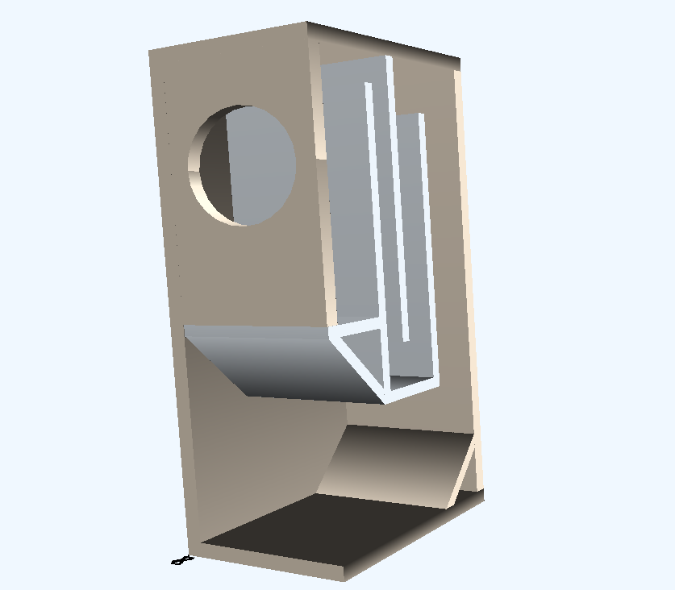  

### 履歴
2024/03/22  グリッド表示速度若干改善  
2024/03/21  図面コメント追加、バックアップ処理をシステム設定ダイヤログに集約  
2024/03/17 イメージデータトリミングダイヤログ追加  
2024/03/13 データバックアップ機能追加 
2024/03/10 画面コピー/保存機能追加  
2024/03/08 要素コピー/ペースト(クリップボード経由)  
2024/03/04 計測機能追加  
2024/03/01 レイヤ機能をサポート  
2024/02/28 トリムコマンド追加  
2024/02/24 ミラー(反転)コマンド追加  
2024/02/20 オートロケイト機能など操作機能追加  
2024/02/08 3D表示をOpenGL(OpenTK)に変更  
2023/12/25 プロトタイプの原型(自作グラフィックライブラリ)  

### ■実行環境
[Mini3DCad.zip](Mini3DCad.zip)をダウンロードして適当なフォルダに展開し、フォルダ内の Mini3DCad.exe をダブルクリックして実行します。  
動作環境によって「.NET 7.0 Runtime」が必要になる場合もあります。  
https://dotnet.microsoft.com/ja-jp/download

### ■開発環境  
開発ソフト : Microsoft Visual Studio 2022  
開発言語　 : C# 10.0 Windows アプリケーション  
フレームワーク　 :  .NET 7.0  
NuGetライブラリ : なし  
自作ライブラリ  : CoreLib (三次元の幾何計算も含む)  
