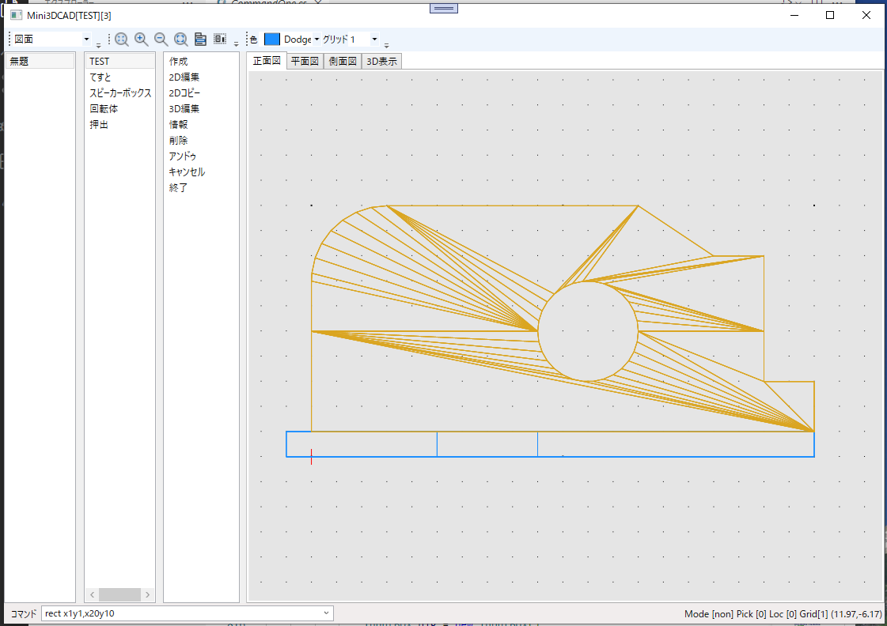
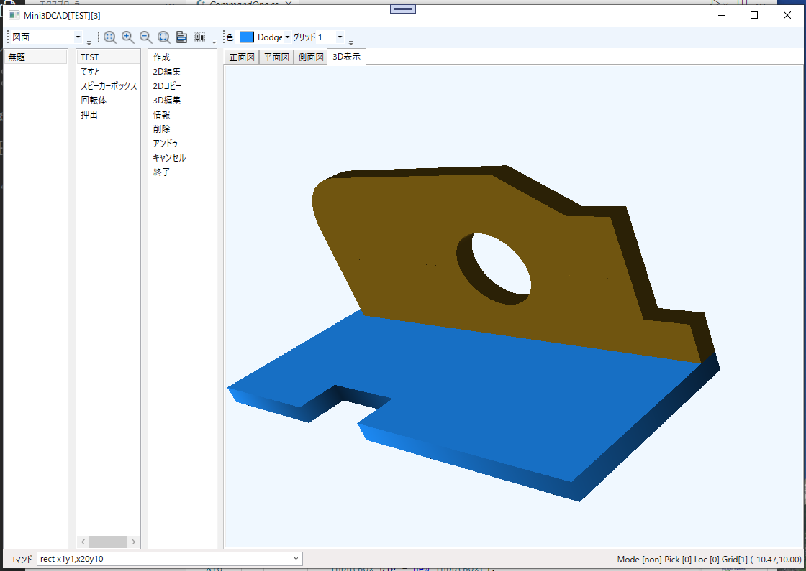

# Mini3DCad
## 三面図からつくる三次元ＣＡＤ

平面図や側面図で作成した図形から3D図形を作成する三次元CAD  
当初、サーフェースのグラフィックライブラリを自作して作っていたが描画速度や機能的に限界があったので OpenGL を使って作成。  

### 画面(とりあえず)
2D表示    
  

3D表示
  

### 履歴
2024/02/08 3D表示をOpenGL(OpenTK)に変更
2023/12/25 プロトタイプの原型(自作グラフィックライブラリ)

### ■実行環境
[Mini3DCad.zip](Mini3DCad.zip)をダウンロードして適当なフォルダに展開し、フォルダ内の Mini3DCad.exe をダブルクリックして実行します。  
動作環境によって「.NET 7.0 Runtime」が必要になる場合もあります。  
https://dotnet.microsoft.com/ja-jp/download

### ■開発環境  
開発ソフト : Microsoft Visual Studio 2022  
開発言語　 : C# 10.0 Windows アプリケーション  
フレームワーク　 :  .NET 7.0  
NuGetライブラリ : なし  
自作ライブラリ  : CoreLib (三次元の幾何計算も含む)  
